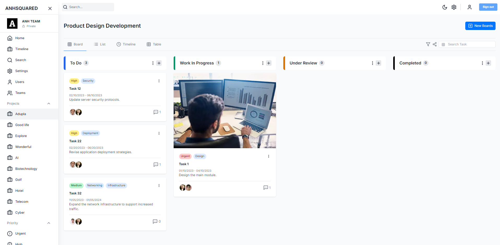

# Project Management App
This project involves the creation of a modern project management app, designed to streamline task and project management. The app allows users to add tasks to a backlog, track task progress through various stages, set priorities, and search for tasks efficiently. It also includes a dark mode for enhanced user experience. The frontend is built with Next.js for performant interfaces, styled using Tailwind CSS, and features Material UI Data Grid for handling complex data presentations. State management is streamlined with Redux Toolkit, while Redux Toolkit Query ensures effective data fetching.



## Table of content
- Technologies
- Project structure
- Getting start

## Technologies 
- Next JS
- Tailwind
- Redux Toolkit
- Redux Toolkit Query
- Material UI Data Grid
- Node.js
- Prisma
- PostgreSQL

## Getting Started
- First, add PORT and DATABASE_URL to the .env file on the server side, and add NEXT_PUBLIC_API_BASE_URL to the .env.local file on the client side.
- Second, create the database and data using the following commands:
```bash
npx prisma generate 
npx prisma migrate dev –-name init
npm run seed
```
- Finally, run the development server for both backend and frontend:

```bash
npm run dev
# or
yarn dev
# or
pnpm dev
# or
bun dev
```

Open [http://localhost:3000](http://localhost:3000) with your browser to see the result.

<!-- 
Deploy link: https://main.d2io4uuo4tn0mm.amplifyapp.com/
Test username: Anhnguyen
Test password: Anhnguyen_123
-->

